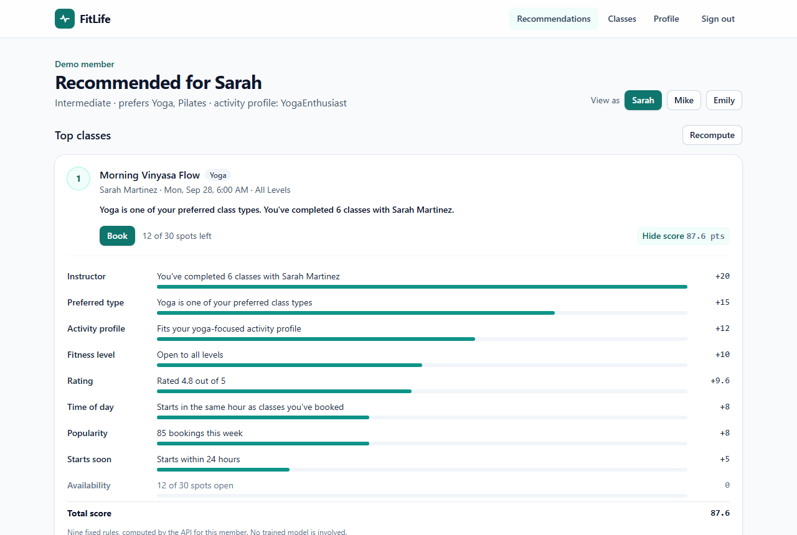

# FitLife demo guide

How to run the demo locally, what to show in five minutes, and what each claim
rests on. Labels follow the repository's evidence vocabulary: **verified** means
exercised by a test or command, and **configured** means present in files but
not proven live.



## Run it

### One command (Docker only)

```powershell
docker compose -f docker-compose.yml -f docker-compose.minimal.yml up -d --build api scheduler web
```

This starts SQL Server, the API, the scheduler, and the web app, without Kafka
or Redis. The API runs in demo mode: it applies migrations and seeds the
synthetic catalog and personas at startup. It also persists events in-request
(the Direct transport) and reads recommendations straight from SQL
(`Cache:Provider=None`); see [Worker topology](public-docs/Worker-Topology.md#kafka-free-minimal-demo).

- App: <http://localhost:3000>
- API and Swagger: <http://localhost:5269/swagger>

The full event pipeline (Kafka broker, consumer, and dead-letter topic) is
`docker compose up -d --build`.

### From source

```powershell
docker compose up -d sqlserver redis                           # dependencies only
dotnet run --project FitLife.Api -- --Events:Transport=Direct  # demo mode is on in the launch profile
cd fitlife-web; npm ci --legacy-peer-deps; npm run dev          # http://localhost:3000
```

## The five-minute demo

1. **Home.** The headline says what this is: rankings you can audit, produced by
   fixed rules rather than a trained model. Point out that there is no sign-up.
2. **Explore as Sarah.** One click starts a session for a synthetic member and
   resets her to a known state. Her top classes are morning yoga with the
   instructor she has trained with most.
3. **Why #1?** Open the breakdown on the top card. It lists all nine rules, each
   with its points and the fact behind them, for example "You've completed 6
   classes with Sarah Martinez, +20". The one-line reason above the card is
   built only from rules that scored.
4. **Book.** The card shows *Booked* and the seat count drops immediately. The
   re-rank happens afterwards; if it fails, the booking still stands and a quiet
   warning appears.
5. **View as Mike.** The same catalog ranks differently: evening HIIT and
   strength come first for an advanced member with that history.
6. **View as Emily.** With only one completed class, her ranking leans on
   stated preferences, level fit, and class quality. The reasons say so.
7. **Profile (optional).** Change a preferred class type and save. The ranking
   updates, because preferred types are worth 15 points.

Starting a session for a persona always resets that persona. Anything the
previous visitor booked is undone, and seats return to the catalog.

## What to point out, and the evidence

| Claim | Evidence |
|---|---|
| Explanations never cite a rule that did not score | **Verified**: `ExplainableRecommendationTests`, and the e2e journey checks the breakdown |
| Two personas get different, stable rankings | **Verified**: `DemoPersonaTests` (disjoint top three, repeatable across sessions) |
| The scheduled profiler agrees with every seeded persona | **Verified**: `ScheduledProfiler_AssignsEverySeededUserTheSegmentTheyAreSeededWith` |
| The last seat cannot be double-booked | **Verified** against SQL Server in CI: `ConcurrentLastSeatRequests_CreateExactlyOneBooking` |
| Duplicate events are stored once | **Verified** against SQL Server in CI, for both the Kafka consumer and the Direct transport |
| Concurrent persona resets and seeding stay consistent | **Verified** against SQL Server in CI (transaction-scoped application locks) |
| The demo flow works on desktop and mobile, by keyboard, with no serious axe violations | **Verified**: Playwright `e2e` job in CI |
| Separate API, consumer, and scheduler processes | **Configured** in Compose and Kubernetes; a local Compose smoke run is recorded |
| A hosted public demo | **Not yet deployed** |

## Operator access

Catalog create, update, and delete require the `Operator` role. Self-registration
and demo sessions always create members. In Development only, a seeded account
can be granted operator access through server-side configuration:

```powershell
$env:DemoAuthorization__OperatorEmails__0 = "sarah.johnson@example.com"
```

Sign in with that account's email and the local demo password `Demo123!` after
setting the value. Production configuration rejects this allowlist at startup.

## Troubleshooting

| Symptom | Check |
|---|---|
| "Demo personas are unavailable" | The API is still starting; `curl http://localhost:5269/health/ready` |
| "Demo mode is off in this environment" | Set `Demo__Enabled=true` for the API |
| A container name is already in use | An older FitLife stack exists; `docker compose down`, or use `-p <name>` |
| Port 1433, 6380, 5269, or 3000 is busy | Stop the other process, or change the host port mapping |
| Recommendations look stale after a booking | Select **Recompute**; the cache is invalidated on a best-effort basis |

For the design behind the demo, see [Recommendation model](public-docs/Recommendations.md),
[Architecture](public-docs/Architecture.md), and [Worker topology](public-docs/Worker-Topology.md).
