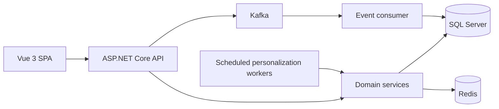

# FitLife Personalization Engine

An explainable, event-driven gym-class personalization case study built with
.NET 8, Vue 3, SQL Server, Redis, and Kafka.

FitLife combines member preferences, fitness level, instructor affinity,
schedule, class availability, ratings, recency, popularity, and behavior-derived
segments to produce ranked recommendations with human-readable reasons. The
current engine is intentionally deterministic: it demonstrates transparent
decision-system design without presenting a trained model or an LLM as a
requirement.

> **Project status:** active portfolio case study. The application and its local
> Docker environment are implemented and tested. A public hosted environment has
> not yet been verified. Kubernetes and disabled Azure deployment assets are
> configuration evidence, not a claim of a live AKS deployment.

## What this project demonstrates

- Full-stack delivery with ASP.NET Core, EF Core, Vue, TypeScript, Pinia, and
  Tailwind CSS.
- Explainable personalization through a nine-factor deterministic scorer.
- Authorization boundaries for members and catalog operators.
- Durable, transactional booking with database-enforced uniqueness and capacity
  invariants.
- Safe booking retries, optimistic concurrency, idempotency keys, and
  exactly-once capacity restoration on cancellation.
- Redis cache-aside behavior with post-commit invalidation.
- Kafka-based interaction publishing and consumption.
- Health checks, production configuration validation, rate limiting, and
  correlation IDs.
- Reproducible backend and frontend validation in GitHub Actions.

## Product flow

1. A member registers or signs in.
2. The API ranks upcoming classes with available capacity using profile and
   interaction data.
3. Each recommendation includes a concise explanation such as preferred class
   type, instructor affinity, schedule fit, or rating.
4. The member books or cancels a class.
5. Booking state, enrollment, and the corresponding interaction are committed
   atomically.
6. The UI updates the affected class and refreshes recommendations after the
   commit.

Booking state is scoped to the authenticated member. One member cannot inspect
or cancel another member's booking through the class API. Classes with no
remaining capacity are excluded from recommendations. A member's existing
booking remains visible in the class catalog so it can still be cancelled.

## Architecture



The repository is organized as a modular monolith:

```text
FitLife.Api/              HTTP API, authorization, health checks, hosted workers
FitLife.Core/             Domain models, DTOs, scoring and recommendation logic
FitLife.Infrastructure/   EF Core, SQL Server, Redis, Kafka, repositories
FitLife.Tests/            Unit, integration, migration and SQL invariant tests
fitlife-web/              Vue 3 and TypeScript SPA
k8s/                      Configured Kubernetes manifests; not verified live
public-docs/              Public architecture and decision records
scripts/verify.ps1        Reproducible repository validation
```

### Important engineering decisions

| Concern | Implemented approach |
|---|---|
| Personalization | Deterministic weighted scoring with readable reasons |
| Booking uniqueness | SQL Server filtered unique index for active member/class bookings |
| Capacity concurrency | Transactional updates plus SQL Server rowversion |
| Retry safety | Stable duplicate result and optional `Idempotency-Key` |
| Cancellation | Transactional status change, capacity restoration, and `Cancel` interaction |
| Authorization | Caller ownership checks and a named operator policy for catalog mutations |
| Recommendation cache | Redis cache-aside with invalidation only after committed changes |
| Health | Dependency-free liveness and SQL/Redis-aware readiness |

See [Architecture](public-docs/Architecture.md) and
[Design Decisions](public-docs/FitLife-Decisions.md) for the longer rationale.

## Recommendation model

The scorer combines nine explicit factors:

| Factor | Weight or range | Signal |
|---|---:|---|
| Favorite instructor | 20 | Completed-class instructor affinity |
| Preferred class type | 15 | Member-selected preferences |
| Segment alignment | 12 | Behavior-derived member segment |
| Fitness-level match | 10 | Class/member difficulty alignment |
| Time preference | 8 | Historical booking hours |
| Popularity | Up to 8 | Recent class demand |
| Recency | Up to 5 | Time until class starts |
| Availability | -5 to +3 | Remaining-capacity pressure |
| Class rating | Rating x 2 | Aggregate member rating |

These weights are product rules, not learned parameters. Performance values
described elsewhere in the repository are targets unless accompanied by a
retained, reproducible measurement.

## Run locally

### Prerequisites

- Docker Desktop
- .NET 8 SDK
- Node.js 20 or later

### 1. Start local dependencies

```powershell
docker compose up -d sqlserver redis zookeeper kafka
```

This starts SQL Server on port `1433`, Redis on `6380`, and Kafka on `9092`.

### 2. Apply migrations and seed demo data

The API applies pending EF Core migrations at startup. Seed the repeatable demo
personas once:

```powershell
dotnet run --project FitLife.Api --seed
```

### 3. Start the API

```powershell
dotnet run --project FitLife.Api
```

- API: `http://localhost:5269`
- Swagger: `http://localhost:5269/swagger`
- Liveness: `http://localhost:5269/health/live`
- Readiness: `http://localhost:5269/health/ready`

### 4. Start the SPA

```powershell
cd fitlife-web
npm ci --legacy-peer-deps
npm run dev
```

Open `http://localhost:3000`.

For the guided setup and seeded persona list, see
[Quick Start](QUICKSTART.md) and [Demo Setup](DEMO_SETUP.md).

## Verify the repository

Run the same backend/frontend quality gate locally:

```powershell
.\scripts\verify.ps1
```

The script restores and builds the solution, runs backend tests, installs
frontend dependencies, runs lint and frontend tests, builds the production SPA,
and audits production npm dependencies.

SQL Server-specific booking tests run when
`FITLIFE_SQLSERVER_TEST_CONNECTION` points to a disposable SQL Server database
host. They create and remove isolated test databases:

```powershell
$env:FITLIFE_SQLSERVER_TEST_CONNECTION = "<SQL Server test connection>"
dotnet test FitLife.Tests --filter "FullyQualifiedName~BookingConcurrencyTests"
```

The latest backend gate completed with 102 tests passing, including the SQL
Server concurrency, rollback, and event-deduplication harnesses. The unchanged
frontend suite remains at 18 passing tests. This
is local verification evidence, not a production performance or availability
claim.

## API surface

| Area | Routes |
|---|---|
| Authentication | `POST /api/auth/register`, `POST /api/auth/login` |
| Members | `GET /api/users/{id}`, `PUT /api/users/{id}/preferences`, `DELETE /api/users/{id}` |
| Classes | `GET /api/classes`, `GET /api/classes/{id}`, `GET /api/classes/popular` |
| Booking | `POST /api/classes/{id}/book`, `POST /api/classes/{id}/cancel` |
| Catalog management | `POST /api/classes`, `PUT /api/classes/{id}`, `DELETE /api/classes/{id}` |
| Recommendations | `GET /api/recommendations/{userId}`, `POST /api/recommendations/{userId}/refresh` |
| Events | `POST /api/events`, `POST /api/events/batch` |
| Operations | `GET /health/live`, `GET /health/ready`, `GET /health` |

Swagger provides the complete request and response schemas in Development.

## Security and data integrity

- Passwords are hashed with BCrypt.
- JWT authentication protects member operations.
- User, recommendation, and event routes enforce subject ownership.
- Catalog mutations require the `ManageCatalog` operator policy.
- Client-supplied registration data cannot grant the operator role.
- Production startup rejects placeholder secrets, local dependency endpoints,
  and unsafe demo-operator configuration.
- Booking foreign keys, status values, active uniqueness, capacity bounds, and
  idempotency-key uniqueness are enforced in SQL Server.
- Booking creation and cancellation invalidate recommendation cache entries only
  after the database transaction commits.

FitLife is a demonstration system and should be used only with seeded or
synthetic data. It is not intended to collect real health information.

## Delivery status

### Verified in the repository

- Backend build and tests.
- Frontend lint, tests, and production build.
- Production npm dependency audit.
- SQL Server booking concurrency and forced-failure rollback behavior.
- Authorization denial and allowance paths.
- Liveness/readiness behavior under dependency failure.

### Implemented, with further hardening planned

- Kafka producer and consumer with a versioned event envelope, broker-acknowledged
  publishing, and SQL-enforced event deduplication.
- Scheduled recommendation generation and user profiling.
- Kubernetes manifests and horizontal-scaling configuration.

The Kafka consumer applies three bounded processing attempts and publishes
metadata-only poison-event records to `user-events-dlq` before committing the
source offset. Scheduled workers are still co-located with the API; they must
receive an explicit singleton owner or separate deployment before horizontal
API scaling is enabled.

### Not currently claimed

- A live public FitLife deployment.
- A live AKS environment.
- Measured latency, throughput, cache-hit, availability, or consumer-lag
  results.
- Real users, adoption, retention improvement, or commercial use.

GitHub Actions currently runs validation. Image publishing and Azure deployment
jobs remain intentionally disabled until a deployment target is selected and
provisioned.

## Technology

- .NET 8, ASP.NET Core, EF Core 9, SQL Server
- Vue 3, TypeScript, Pinia, Vite, Tailwind CSS
- Redis, Kafka, Docker Compose
- xUnit, Vitest, FluentAssertions, Moq
- GitHub Actions
- Configured Kubernetes and Azure-oriented deployment assets

## Documentation

- [Quick Start](QUICKSTART.md)
- [Demo Setup](DEMO_SETUP.md)
- [Architecture](public-docs/Architecture.md)
- [Design Decisions](public-docs/FitLife-Decisions.md)
- [Recommendation Model](public-docs/Recommendations.md)

## License

[MIT](LICENSE)
