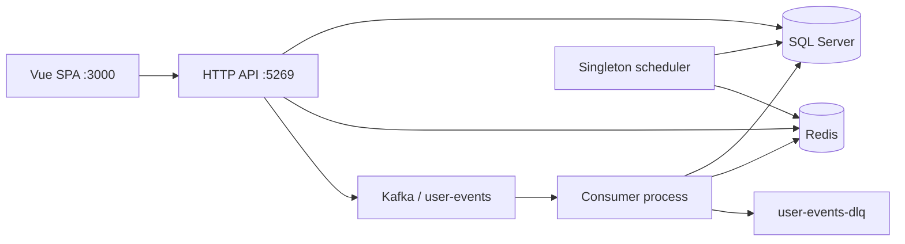

# FitLife Architecture Documentation

**High-level system design, component interactions, and technology choices.** For implementation-level decisions (specific patterns, timing values, weights), see [FitLife-Decisions.md](FitLife-Decisions.md).

## Status labels

This is a work-in-progress portfolio case study. Claims in this document carry one of three labels:

- **Implemented** — code exists in this repository and runs against the local Docker Compose stack.
- **Configured** — a config file or manifest exists, but the behavior it describes has not been exercised at the scale it implies.
- **Planned** — not built. Included to show intended direction.

Nothing here has been load-tested. No latency, throughput, or availability figure in this document is a measurement.

## Table of Contents
1. [System Overview](#system-overview)
2. [Architecture Principles](#architecture-principles)
3. [Component Design](#component-design)
4. [Data Flow](#data-flow)
5. [Scalability & Performance](#scalability--performance)
6. [Security Architecture](#security-architecture)
7. [Trade-offs & Decisions](#trade-offs--decisions)

## System Overview

FitLife shares a .NET 8 codebase and image across separate HTTP API, Kafka consumer, and singleton scheduler processes. Process responsibilities are isolated; this is not a claim of independently versioned microservices.

### Local runtime (Implemented)

The Compose configuration assigns separate process roles (configured, not a live deployment claim):



See [Worker Topology](Worker-Topology.md) for role configuration and singleton limitations.

**One broker, replication factor 1.** `KAFKA_OFFSETS_TOPIC_REPLICATION_FACTOR: 1` and a single `kafka` service mean there is no replication locally. Topics are auto-created (`KAFKA_AUTO_CREATE_TOPICS_ENABLE: "true"`) at the broker default partition count, so `user-events` is single-partition unless created explicitly. Both facts constrain the guarantees described below.

### Deployment target (Planned)

The portfolio target is Azure Container Apps with Azure SQL and explicitly budgeted optional dependencies. Kubernetes manifests remain configured architecture evidence, not a deployed AKS environment.

## Architecture Principles

### 1. Separation of Concerns (Implemented)
- **Presentation**: Vue.js SPA
- **API**: ASP.NET Core controllers
- **Domain**: services (`RecommendationService`, `ScoringEngine`)
- **Data**: EF Core repositories over `FitLifeDbContext`

### 2. Event-Driven Ingestion (Implemented)
- `/api/events` publishes a versioned envelope to Kafka and waits for broker acknowledgement before responding.
- Downstream processing is asynchronous. Interaction rows appear after the consumer processes the message, not when the API responds.
- Partition key is `UserId`, which preserves per-user ordering within a partition.
- The `Interactions` table is an append-only record of consumed events. It is not event sourcing: application state is not rebuilt by replaying it.

### 3. Caching (Implemented)
- **Cache-aside**: check Redis, fall back to the `Recommendations` table, then regenerate.
- **TTL**: 10 minutes on `rec:{userId}`.
- **Explicit invalidation**: booking and cancellation invalidate after commit; the event consumer invalidates on `Book`, `Cancel`, `Complete`, and `Rate`.

There is no write-through caching and no Redis-backed session store. JWTs are stateless.

### 4. API Design (Implemented)
- REST over JSON, standard status codes.
- Responses use a consistent `ApiResponse<T>` envelope.
- Routes are unversioned (`/api/events`, `/api/classes`). URL versioning is **Planned**.
- Offset-based pagination on list endpoints. Cursor pagination and HATEOAS links are **Planned**.

## Component Design

### 1. API Service (.NET 8)

#### Controllers (Implemented)
```
UsersController            → User profile
ClassesController          → Class catalog, booking, cancellation
RecommendationsController  → Personalized recommendations
EventsController           → Event tracking (single + batch)
AuthController             → Registration, login
```

`EventsController` depends on `IEventPublisher` directly. There is no `EventService` indirection.

#### Domain services (Implemented)
```
RecommendationService  → Generate, cache, invalidate recommendations
ScoringEngine          → Multi-factor class scoring
```

#### Infrastructure (Implemented)
```
KafkaProducer     → IEventPublisher + IDeadLetterPublisher
RedisCacheService → ICacheService
JwtService        → Token issuance and validation
```

#### Repositories (Implemented)
```
UserRepository         → User data access
ClassRepository        → Class data access
InteractionRepository  → Interaction reads/writes, ExistsByEventIdAsync
```

### 2. Kafka producer configuration (Implemented)

From `KafkaProducer`:

| Setting | Value | Effect |
|---|---|---|
| `Acks` | `All` | Leader waits for all in-sync replicas |
| `EnableIdempotence` | `true` | Producer-side retry deduplication and ordering within a partition |
| `MaxInFlight` | `5` | Compatible with idempotence |
| `MessageTimeoutMs` / `RequestTimeoutMs` | `30000` | Publish fails rather than hanging the request |
| `CompressionType` | `Snappy` | |
| `LingerMs` / `BatchSize` | `10` / `16384` | Small batching |

**`acks=all` does not prove durability on the local stack.** With one broker and replication factor 1, the in-sync replica set is a single node, so `acks=all` is equivalent to `acks=1`. The acknowledgement means one broker wrote the record to its log. Replicated durability requires a multi-broker cluster with `min.insync.replicas` ≥ 2, which is **Planned**.

**Producer idempotence is not end-to-end idempotency.** It suppresses duplicates caused by producer retries within a producer session and partition. It does nothing about a client that retries an HTTP request, and nothing about a consumer that reprocesses a message after a rebalance. Those are handled separately, below.

### 3. Background Workers (Verified process separation)

The Consumer role hosts `EventConsumerService`. The Scheduler role hosts the generator and profiler. The Api role hosts none of these workers. Generic worker hosts expose no HTTP routes.

#### EventConsumerService
- **Consumes**: `user-events`, group `fitlife-event-consumers`
- **Offsets**: `EnableAutoCommit = false`; offsets are committed manually after processing or dead-letter handling
- **Poll**: one message per iteration, `MaxPollIntervalMs` 300000, `SessionTimeoutMs` 45000
- **Operations**: deserialize, validate the contract, deduplicate on `EventId`, insert an `Interaction`, invalidate the recommendation cache for `Book` / `Cancel` / `Complete` / `Rate`

It does not update a user last-active timestamp and does not update class enrollment counts. Enrollment is maintained by the booking transaction, not by this consumer.

#### RecommendationGeneratorService
- **Frequency**: every 10 minutes
- **Operations**: select users needing refresh, score candidates, persist to `Recommendations`, populate Redis

#### UserProfilerService
- **Frequency**: every 30 minutes
- **Operations**: analyze the last 30 days of interactions, assign a segment, update `User.Segment`

### 4. Frontend (Implemented)

```
Pinia stores:   authStore, userStore, classStore, recommendationStore
Services:       authService, classService, recommendationService, analyticsService
Components:     ClassCard, ClassList, ClassFilter, RecommendationFeed, ProfileForm
```

## Data Flow

### 1. User Registration
```
POST /api/auth/register
    → hash password (BCrypt)
    → insert User
    → issue JWT
    → return token + profile
```

### 2. Class Browsing
```
GET /api/classes?page=1&pageSize=20
    → ClassRepository.GetClasses()
    → return ClassResponse DTOs (includes IsBookedByCurrentUser when authenticated)
```

### 3. Recommendation Generation
```
GET /api/recommendations/{userId}?limit=10
    → check Redis rec:{userId}
    → hit  → return
    → miss → check Recommendations table (generated < 10 min ago)
             → fresh → return + repopulate cache
             → stale → score candidates, persist, cache (10 min TTL), return
```

### 4. Event Tracking

**Ingestion (synchronous portion):**
```
POST /api/events                    [Authorize]
    → EventsController.TrackEvent()
    → token subject must equal EventDto.UserId, else 403
    → validate contract:
        EventType ∈ EventTypes.ValidTypes
        ItemId ≤ 200 chars, ItemType ≤ 50 chars
        EventId, if supplied, must parse as a GUID
        SchemaVersion, if supplied, must be 1
        OccurredAt within [now-24h, now+5m]
        Metadata ≤ 8 KiB serialized
    → EventId := caller-supplied value, or a server-generated GUID if absent
    → KafkaProducer.PublishAsync("user-events", key: UserId, envelope)
    → await broker acknowledgement
    → 200 OK { eventId, schemaVersion, occurredAt }
```

The endpoint returns **200 OK**, not 202 Accepted.

**Retry semantics.** Because the publish is awaited, a 200 means the broker accepted the record. If the response is lost and the caller retries, the retry is the *same logical event only if the caller supplied `EventId` and reuses the same value*. When `EventId` is omitted, the server generates a fresh GUID per request, so a retry produces a second distinct event that consumer deduplication will not collapse. Callers that need retry safety must generate and retain their own `EventId`.

**Consumption (asynchronous portion):**
```
EventConsumerService.Consume()
    ↓
deserialize UserEvent
    ├─ null or malformed JSON → DLQ immediately, no retry
    ↓
validate contract (schema version, EventId GUID, required fields,
                   OccurredAt window, metadata size)
    ├─ invalid → DLQ immediately, no retry
    ↓
ExistsByEventIdAsync(EventId)?
    ├─ yes → skip insert
    └─ no  → insert Interaction
             └─ SQL 2601/2627 on IX EventId → treat as duplicate
    ↓
EventType ∈ {Book, Cancel, Complete, Rate}?
    └─ yes → InvalidateCacheAsync(userId)
    ↓
unhandled exception at any point above
    → retry up to MaxAttempts (default 3, clamped 1–10)
      with linear backoff (default 250ms × attempt)
    → attempts exhausted → publish DLQ metadata, await ack
    ↓
commit source offset          ← separate, non-transactional step
```

**Deduplication.** The pre-check (`ExistsByEventIdAsync`) is an optimization. The unique filtered index `IX_Interactions_EventId` is the actual concurrency boundary: a duplicate-key violation (SQL error 2601 or 2627) is caught and treated as "already processed." Cache invalidation runs on the duplicate path too, so a crash between insert and invalidation can recover on redelivery.

**Retry classification.** The retry loop catches all exceptions except cancellation. There is no transient-versus-fatal classification. A sustained SQL Server outage will exhaust attempts and dead-letter messages exactly as a deterministic bug would. Retries are short by default (roughly 750ms total across three attempts), so they do not approach `MaxPollIntervalMs`.

**DLQ contents.** `DeadLetterEvent` carries metadata only: `DeadLetterId`, `SchemaVersion`, `FailedAt`, source topic/partition/offset, message key, `EventId`, `Disposition`, and `Attempts`. **The original payload is not retained**, so the DLQ supports investigation but not replay. Dispositions currently emitted: `null-payload`, `malformed-json`, `unsupported-schema`, `invalid-event-id`, `invalid-contract`, `invalid-occurred-at`, `metadata-too-large`, `retries-exhausted`.

**DLQ and offset commit are not atomic.** The dead-letter publish is awaited to its own broker acknowledgement, and only then does the loop commit the source offset. These are two separate operations. A crash between them causes the message to be redelivered on restart and dead-lettered a second time, so **the DLQ topic can contain duplicate records for one source message**. Consumers of the DLQ should be idempotent or deduplicate on source partition and offset. If the offset commit itself throws, the error is logged and the loop continues; redelivery is possible after restart/reassignment but is not guaranteed on the next poll. If processing and DLQ publication fail, the consumer stops before polling another record so a later commit cannot skip that record.

**Batch endpoint.** `POST /api/events/batch` accepts up to 100 events and publishes them sequentially, awaiting each. If publishing fails partway through, earlier events are already durable in Kafka but the response is a 500 with no partial-success detail. A caller retrying the whole batch without stable `EventId` values will duplicate the events that already succeeded.

### 5. Class Booking
```
POST /api/classes/{classId}/book
    → return the existing active booking for a duplicate retry
    → check capacity
    → in one database transaction:
        create the active booking
        increment Class.CurrentEnrollment
        create one "Book" interaction
    → after commit, invalidate rec:{userId}
    → return booked | already-booked | full | conflict

POST /api/classes/{classId}/cancel
    → find only the authenticated user's active booking
    → in one database transaction:
        mark the booking cancelled
        decrement Class.CurrentEnrollment once
        create one "Cancel" interaction
    → after commit, invalidate rec:{userId}
    → return cancelled | already-cancelled | not-found | conflict
```

Clients may send an `Idempotency-Key` header (up to 100 characters). This header applies to **booking only**; `/api/events` does not read it. Database-enforced constraints (`FitLifeDbContext`):

- `IX_Bookings_UserId_ClassId` unique, filtered on `Status = 'Active'`
- `IX_Bookings_IdempotencyKey` unique, filtered on non-null
- `CK_Bookings_Status` restricts status to `Active` or `Cancelled`
- `CK_Classes_Enrollment_WithinCapacity` keeps enrollment in `[0, Capacity]`
- `Class.RowVersion` provides optimistic concurrency

Repeated cancellation is safe: it does not restore a second seat or create another interaction. Booking does not publish a Kafka event; `/api/events` is the only publishing path.

## Scalability & Performance

### What scales today

**API tier (Configured).** The API holds no in-memory session state, so it is stateless with respect to HTTP requests. Kubernetes manifests and an API HPA (3–10 pods) exist in the repository.

**Event consumers (Implemented, bounded by partitions).** `EventConsumerService` joins the consumer group `fitlife-event-consumers`, so consumers can share partitions. Parallelism is capped by the partition count of `user-events`. Because the local stack relies on topic auto-creation at the broker default, that cap is currently one partition and therefore one effective consumer.

### What does not scale today

`RecommendationGeneratorService` and `UserProfilerService` belong exclusively to the Scheduler role. Compose constrains that service to one named container; Kubernetes configures one replica with `Recreate` and no HPA. There is **no distributed lease or fencing**: do not start another scheduler against the same database. API and consumer replicas do not multiply scheduled work.

**The Kubernetes and HPA assets are configuration evidence, not proof that the current worker topology is safe to scale.** They describe an intended deployment. They have not been run in a multi-replica cluster.

### Redis keys (Implemented)
```
Key Pattern            TTL      Purpose
------------------------------------------------------
rec:{userId}           10 min   User recommendations
```

Additional key patterns for popular-class and class-detail caching are **Planned**. There is no session key: JWTs are stateless.

### Database indexes (Implemented, from FitLifeDbContext)
```sql
-- Users
IX_Users_Email                      UNIQUE

-- Classes
IX_Classes_StartTime_Type_IsActive  FILTERED ON [IsActive] = 1

-- Interactions
IX_Interactions_EventId             UNIQUE, FILTERED ON [EventId] IS NOT NULL
IX_Interactions_UserId_Timestamp    (UserId ASC, Timestamp DESC)
IX_Interactions_ItemId

-- Bookings
IX_Bookings_UserId_ClassId          UNIQUE, FILTERED ON [Status] = 'Active'
IX_Bookings_IdempotencyKey          UNIQUE, FILTERED ON non-null
IX_Bookings_ClassId_Status

-- Recommendations
PK (UserId, ItemId)
IX_Recommendations_UserId_Rank      INCLUDE (Score, Reason)
```

`IX_Interactions_EventId` is the dedupe boundary described in [Data Flow §4](#4-event-tracking). It has no retention policy: `Interactions` grows without bound, so deduplication remains correct indefinitely but the index grows with total interaction history.

### Query patterns (Implemented)
- `AsNoTracking()` on read paths
- Candidate classes limited to 100 per generation pass
- Projection to DTOs rather than returning entities

### Design targets (not measurements)

| Metric | Target |
|---|---|
| API P50 latency | < 100 ms |
| API P95 latency | < 200 ms |
| API P99 latency | < 500 ms |
| Recommendation cache hit rate | > 90% |
| Kafka consumer lag | < 1 minute |
| Recommendation generation | < 2 seconds |

None of these has been measured. Confirming them requires a load test against a deployed environment, which is out of scope for this case study. `Recommendations.md` frames its evaluation metrics the same way.

## Security Architecture

### Implemented

- **Authentication**: JWT bearer tokens issued at login and registration. `[Authorize]` on protected controllers.
- **Ownership checks**: `/api/events` compares the token subject to `EventDto.UserId` and returns 403 on mismatch. Cancellation is scoped to the authenticated user's own booking.
- **Response scoping**: authenticated class and recommendation responses include only the requesting member's booking state.
- **Password storage**: BCrypt with per-password salt.
- **Parameterized access**: EF Core throughout; no string-concatenated SQL.
- **Input validation**: contract validation at the API boundary and again in the consumer, so a malformed event cannot reach the database from either path.

### Local development posture

The Compose stack uses plaintext HTTP, `PLAINTEXT` Kafka listeners, and a hardcoded SA password. It is a development environment and is not hardened.

### Planned

TLS termination and HSTS, secrets in Azure Key Vault or Kubernetes Secrets, rate limiting at the gateway, CORS restricted to a deployed origin, and key rotation. None of this is implemented in the current stack.

## Trade-offs & Decisions

### 1. SQL Server for user, booking, and interaction data

**Decision**: SQL Server 2022 locally; a managed SQL service is the deployment target.

- Strong consistency and ACID transactions, which booking needs to keep enrollment and booking rows in agreement
- Unique filtered indexes give database-enforced idempotency for both bookings and event deduplication
- Rich querying for scoring inputs
- Vertical scaling limits; read replicas are Planned

**Alternative considered**: MongoDB for user profiles. Flexible schema, but weaker consistency and no equivalent of the filtered unique constraints this design leans on.

### 2. Kafka for event transport

**Decision**: Apache Kafka, running as a single-broker container locally.

- Partitioning by `UserId` preserves per-user ordering
- Consumer groups allow horizontal consumer scaling once topics have multiple partitions
- Retained log supports replay of the source topic
- Operationally heavier than a managed queue, and the local single-broker setup provides no replication

**Alternative considered**: Azure Service Bus. Lower operational overhead and a built-in dead-letter queue, which would have removed the hand-rolled DLQ path and its non-atomic commit seam described above. Rejected for partitioned ordering and replay. Azure Event Hubs is a possible managed target but is **not** the current runtime.

### 3. Batch recommendation generation

**Decision**: Hybrid. Batch generation every 10 minutes, Redis for reads, explicit invalidation on state changes.

- Amortizes scoring cost instead of paying it per request
- Not real-time; a new interaction affects the next generation pass
- Acceptable for a class catalog that changes slowly

**Alternative considered**: fully real-time ML scoring. Higher compute cost and pipeline complexity than this case study warrants.

### 4. Shared image, separate process roles

**Decision**: reuse one executable/image with explicit Api, Consumer, and Scheduler roles.

- Share repositories and personalization logic without duplicating service wiring.
- Scale HTTP and partition-owned ingestion independently of scheduled work.
- Keep one scheduled owner using deployment constraints; distributed ownership is not implemented.
- Reject incompatible worker enable flags at startup.

### 5. Client-side SPA

**Decision**: Vue.js SPA against the REST API.

- Decoupled deployment, reusable API for a future mobile client
- Initial load cost and SEO limitations

## Monitoring & Observability

### Implemented
- Structured logging via `ILogger` throughout the API and workers, including Kafka partition and offset on publish, dead-letter publication with disposition and attempt count, and duplicate-event detection on both the pre-check and constraint paths.
- **Health checks**: `/health/live` (process liveness, no dependency checks), `/health/ready` (database and Redis), `/health` (alias for readiness).

### Planned
Prometheus metrics, distributed tracing with correlation IDs across services, Application Insights, and OpenTelemetry instrumentation. Not wired up in the current stack.

## Future Enhancements

1. **Replicated Kafka** — multi-broker with `min.insync.replicas` ≥ 2 and explicitly created multi-partition topics, so `acks=all` means what the design assumes.
2. **DLQ replay** — retain the original payload alongside the metadata record, and add a replay path.
3. **Worker operations** — operational counters, live rollout/shutdown evidence, and distributed ownership if scheduler redundancy becomes required.
4. **Machine learning recommendations** — collaborative filtering trained on interaction history, A/B tested against the rule-based scorer.
5. **Real-time notifications** — SignalR push for favorite-instructor class announcements and booking reminders.
6. **Multi-tenancy** — multiple locations with location-scoped recommendations.

---

This architecture is a proof of concept. It is structured to make its own boundaries and failure modes legible rather than to claim production readiness.
